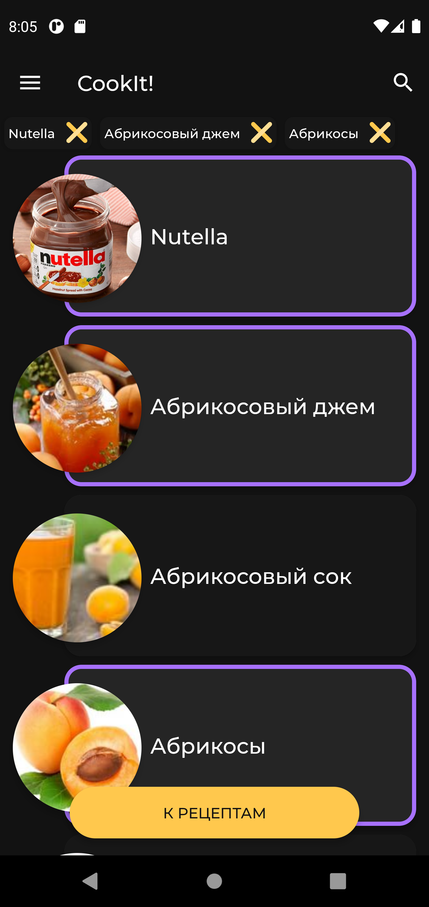
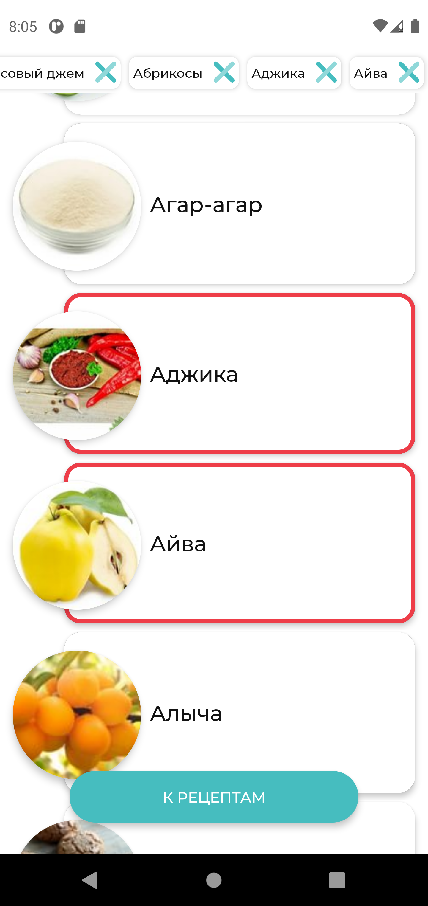
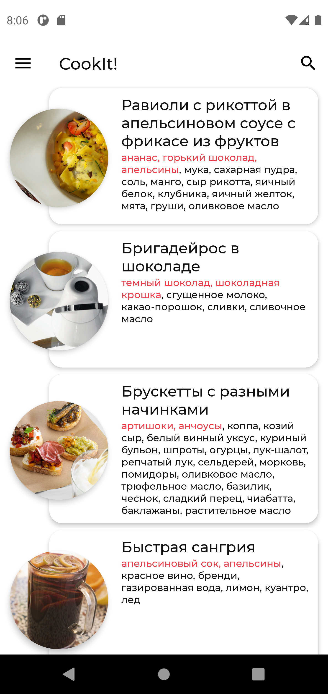
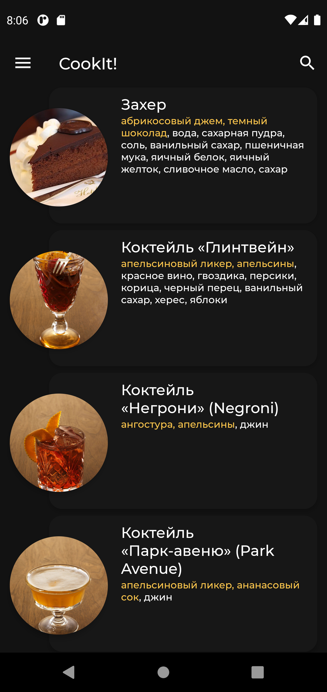
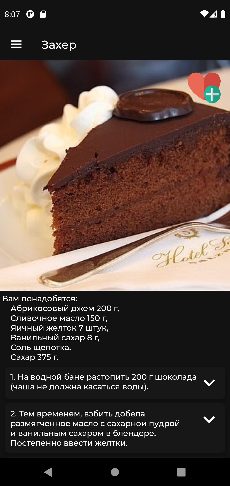
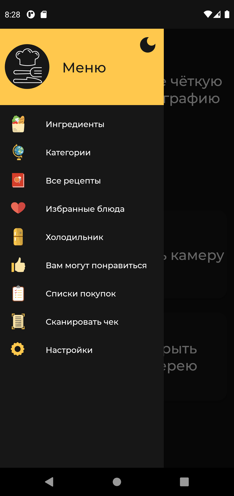
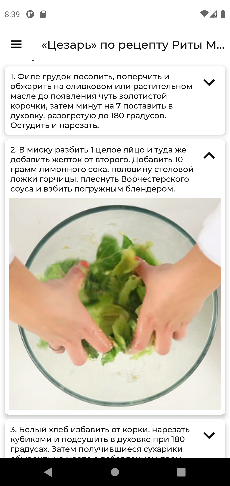
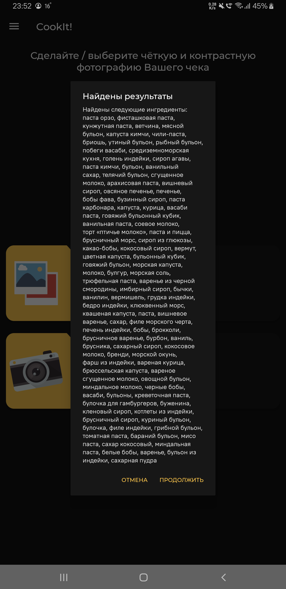

# CookIt! — лучшие рецепты
CookIt! — приложение, которое подберет для Вас рецепты по заданным фильтрам.

Реализована возможность выбирать категории (различные кухни, типы рецептов), ингредиенты.
Блюда фильтруются по релевантности: чем больше выбранных компонентов в рецепте, тем выше он будет в сформированном списке.

Реализован поиск по категориям, ингредиентам и всем блюдам: в шапке доступна поисковая строка.
Приложение может работать и без интернета: база данных полностью хранится в телефоне.

Дополнительные возможности:
- избранные блюда
- холодильник (избранные ингредиенты)
- списки покупок, сгруппированные по блюдам
- рекомендации блюд, основанные на избранных
- сканирование чеков (распознавание ингредиентов, OCR)

## Преимущества
- база данных на более чем 2 000 блюд, 1 000 ингредиентов, 10 000 изображений
- удобный, стильный интерфейс
- возможность работы без интернета

## Начните использовать
Установочный APK-файл собран, Вы можете скачать его [здесь](./app/release/app-release.apk).

## Дополнительные материалы
[Здесь](https://docs.google.com/presentation/d/1FZTXho6n1ZGT4v0Jj_Zoge-rPRDOJFGpTgEtpkwiUfM/edit?usp=sharing) Вы можете ознакомиться с презентацией, а [тут](https://youtu.be/awFPdkjSGAg) — с видео.

## Скриншоты

## Дисклеймер
Все данные взяты с [eda.ru](https://www.eda.ru). Приложение никак не монетизируется, не показывает рекламу и написано с целью популяризации сайта и рецептов на нём на некоммерческой основе.
Соглано [пользовательскому соглашению](https://eda.ru/usage), "Пользователь Сети может загружать («скачивать») с Сайта материалы, охраняемые авторским правом, только для личного использования".