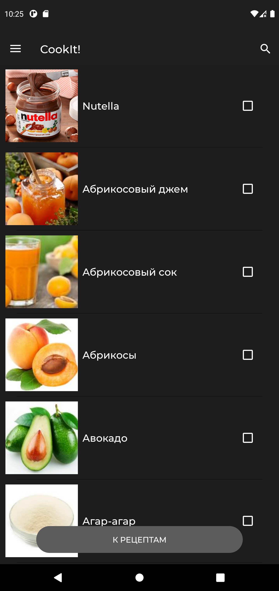
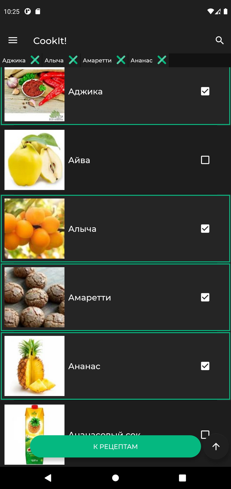
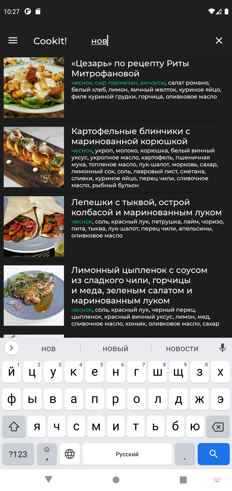
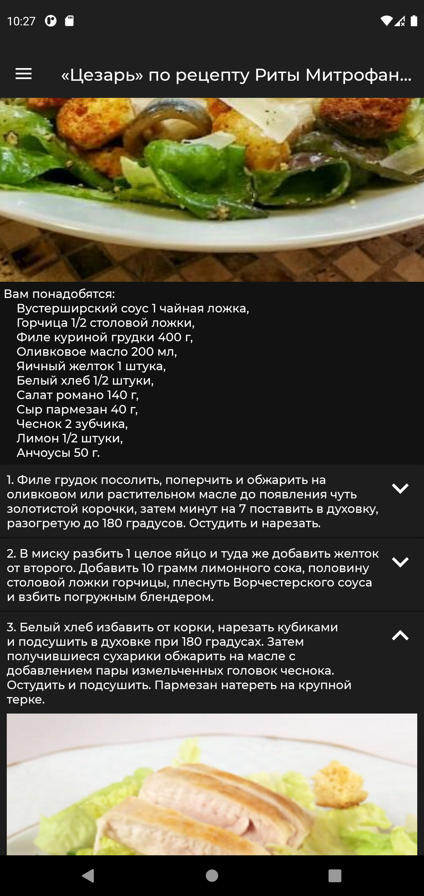
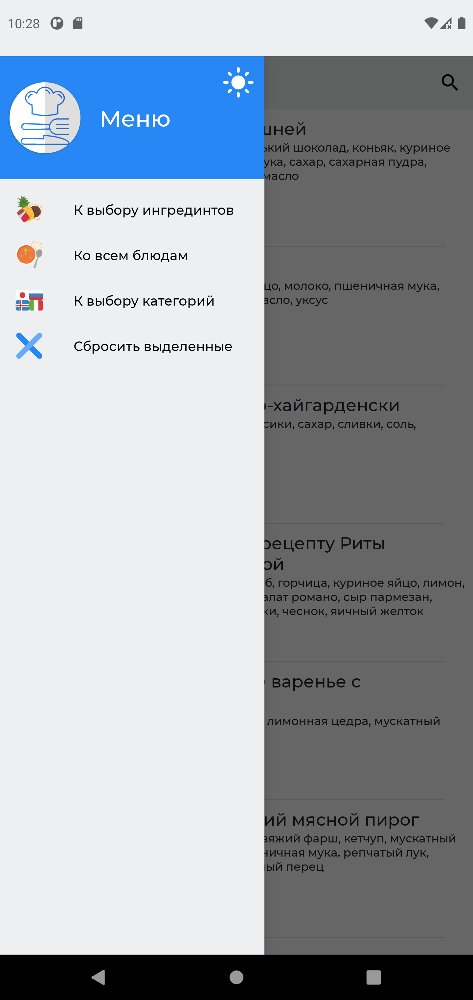
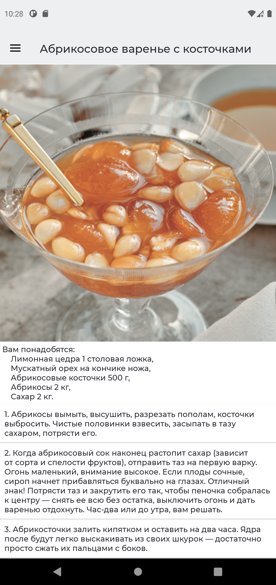

# CookIt!: лучшие рецепты
CookIt! — приложение, которое подберет для вас рецепты по заданным фильтрам.

Преимущества
------------
- рационально использует вычислительные ресурсы, не тормозит
- более 4 500 блюд, 1 500 ингредиентов, 10 000 изображений
- стильно, удобно, интуитивно понятно
- работает даже без интернета

Начните использовать
--------------------
Установочный APK-файл собран, Вы можете скачать его [здесь](CookITRelase.apk)

Дополнительные материалы
------------------------
[Здесь](https://docs.google.com/presentation/d/1FZTXho6n1ZGT4v0Jj_Zoge-rPRDOJFGpTgEtpkwiUfM/edit?usp=sharing) Вы можете ознакомиться с презентацией, а [тут](https://youtu.be/3iFVjcT_f_o) — с видео

Скриншоты
---------

